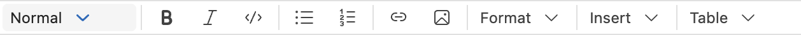
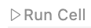
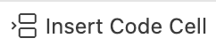

# Introduccion

::: callout-important
Para poder usar este tipo de documentos es necesario primero instalar Quarto en su equipo. Seguir las instrucciones en el sitio web [Quarto](http://quarto.org).
:::

Este es un documento Quarto (`.qmd`). Permite trabajar con texto y ejecutar codigo de manera conjunta para generar un documento completo de su analisis. Para compilar el documento haga click en *Preview* ({width="64"}). @agresti2002 es una referencia clasica para datos categoricos.

Los documentos se pueden crear en modo *Source* o *Visual*. En modo *Visual* (@fig-visual-opts) se puede trabajar el documento como un editor de texto clasico.

{#fig-visual-opts}

Los bloques de codigo se identifican por `{python}`, con opciones (opcionales) en formato YAML que empiezan con `#|` al inicio de cada bloque. Para ejecutar un bloque de codigo se puede hacer click en el boton de *Run* ({width="73" height="18"}) dentro del bloque, o colocando el cursor dentro del bloque y ejecutando *Cmd+Shift+Enter* (Mac) o *Ctrl+Shift+Enter* (Windows).

Se puede agregar un nuevo bloque haciendo click en *Insert Code Cell* ({width="81" height="21"}), o ejecutando *Cmd+Option+I* (Mac) o *Ctrl+Alt+I* (Windows).

El primer bloque siempre se usa para cargar paquetes y datos a usar durante la sesion, asi como parametros opcionales globales. Los bloques pueden llevar una etiqueta (`label`) pero no es necesario; si se usan las etiquetas todas deben ser diferentes, no pueden haber dos bloques de codigo con la misma etiqueta.

```{python}
#| label: paquetes
#| include: false
#| message: false

import numpy as np
import pandas as pd
import matplotlib.pyplot as plt
import seaborn as sns
from plotnine.data import penguins
from great_tables import GT
from plotnine import ggplot, aes, geom_point, labs, theme_set, theme_bw, theme
import plotly.express as px

theme_set(theme_bw())
```

# Importando datos

Los documentos *Quarto* usan una direccion relativa a la ubicación del archivo.

Para importar un archivo CSV o con otra extension se puede usar el paquete **pandas** que proporciona diferentes funciones para leer datos (`pd.read_*`). Aqui se importa un archivo CSV.

```{python}
dat = pd.read_csv("data/LungCapData2.csv")
```

# Tipos de resultados

## Consola

Podemos crear diferentes objetos dentro del bloque como si fuera la consola de **Python**. Creemos un objeto que contenga los numeros del 1 al 14. En este caso creamos un arreglo usando **numpy**.

```{python numeros}
numeros = np.arange(1,15)
numeros
```

Podemos desplegar tablas.

```{python tabla}
dat.head()
```

::: callout-note
Se recomienda que cada tabla vaya en su propio bloque de codigo para poder asignarle una etiqueta y encabezado
:::

Para poder referencias tablas en el texto la etiqueta del bloque donde se genera la tabla debe empezar con `tbl-`.

```{python}
#| label: tbl-pandas
#| tbl-cap: "Tabla usando el paquete **pandas**."

dat.head(10)
```

Tablas mas elaboradas pueden ser creadas usando el paquete **great_tables**.

```{python}
#| label: tbl-greattables
#| tbl-cap: "Tabla usando el paquete **great_tables**."

(
  GT(penguins.head(10))
  .tab_spanner(label="Medidas", columns=["bill_length_mm", "bill_depth_mm", "flipper_length_mm", "body_mass_g"])
  .cols_label(
    species="Especie",
    island="Isla",
    bill_length_mm="Largo pico (mm)",
    bill_depth_mm="Profundidad pico (mm)",
    flipper_length_mm="Largo de la aleta (mm)",
    body_mass_g="Masa corporal (g)",
    sex="Genero",
    year="Año",
  )
)
```

## Graficos

Graficos de **matplotlib**, **seaborn**, **plotnine (ggplot2 en R)** o cualquier otro grafico estatico son resultados que se pueden desplegar dentro del documento (@fig-disp).

::: callout-note
Se recomienda que cada grafico vaya en su propio bloque de codigo para poder asignarle una etiqueta y encabezado a la figura
:::

Para poder referencias figuras en el texto la etiqueta del bloque donde se genera la figura debe empezar con `fig-`.

```{python}
#| label: fig-disp
#| fig-cap: "Grafico de dispersion creado con **matplotlib**."

color_map = {"male": "tab:blue", "female": "tab:orange"}
colors = dat["Gender"].map(color_map)

from matplotlib.lines import Line2D

fig, ax = plt.subplots(figsize=(7, 5))
ax.scatter(dat['Age'], dat['Height'], c=colors, s=50, edgecolors=colors)
ax.set_xlabel('Edad')
ax.set_ylabel('Estatura (pulgadas)')

legend_elements = [
    Line2D([0], [0], marker="o", color="w", markerfacecolor=col, markeredgecolor=col, markersize=8, label=label.capitalize())
    for label, col in color_map.items()
]
ax.legend(handles=legend_elements, title="Genero", loc="upper left")

plt.show()
```

```{python}
#| label: fig-disp2
#| fig-cap: "Grafico de dispersion creado con **plotnine (ggplot2)**."

(
  ggplot(dat, aes('Age', 'Height', color='Gender')) + 
  geom_point(size=4) + 
  labs(x='Edad', y='Estatura (pulgadas)', color='Genero') +
  theme(legend_position='top')
)

```

::: callout-tip
Si se quieren mostrar varios graficos, que tengan alguna relacion, en una sola figura se pueden generar en un mismo bloque y definir un encabezado general para la figura y sub-encabezados para cada grafico, asi como el numero de filas o columnas
:::

```{python}
#| label: fig-penguins
#| layout-ncol: 2
#| fig-cap: "Relaciones entre medidas corporales de pinguinos de diferentes especies"
#| fig-subcap:
#|   - "Relacion con el largo de la aleta"
#|   - "Relacion con el largo del pico" 

color_map = {"Adelie": "tab:blue", "Gentoo": "tab:orange", "Chinstrap": "tab:green"}

fig, ax = plt.subplots()
sns.scatterplot(
    data=penguins,
    x="flipper_length_mm",
    y="body_mass_g",
    hue="species",
    palette=color_map,
    s=60,
    edgecolor="k",
    linewidth=0.5,
    ax=ax,
    alpha=0.9
)
ax.set_xlabel("Largo de la aleta (mm)")
ax.set_ylabel("Masa corporal (g)")
ax.legend(title="Especie", loc="best")
plt.tight_layout()
plt.show()

fig, ax = plt.subplots()
sns.scatterplot(
    data=penguins,
    x="bill_length_mm",
    y="body_mass_g",
    hue="species",
    palette=color_map,
    s=60,
    edgecolor="k",
    linewidth=0.5,
    ax=ax,
    alpha=0.9
)
ax.set_xlabel("Largo del pico (mm)")
ax.set_ylabel("Masa corporal (g)")
ax.legend(title="Especie", loc="best")
plt.tight_layout()
plt.show()
```

@fig-penguins-1 y @fig-penguins-2 muestran la relacion del largo de la aleta y de pico con la masa corporal.

::: {.content-visible when-format="html"}

## Widgets HTML

Si el analisis en **Python** involucra componentes interactivos, estos tambien son compatibles con los resultados en el archivo *html*. Estos **NO** pueden desplegarse en *pdf* o *word*, por lo que se incluyen solo cuando el documento se renderiza a *html*.

La @fig-plotly muestra un grafico interactivo de una serie temporal, creado con el siguiente codigo.

```{python}
#| label: fig-plotly
#| fig-cap: "Grafico interactivo creado con **plotly**."

df = px.data.stocks()
fig = px.line(df, x='date', y=['GOOG', 'AAPL', 'AMZN'], 
              title='Stock Prices Over Time')
fig.show()
```

:::

# Formulas

Expresiones matematicas y formulas se pueden desplegar en linea, dentro del cuerpo del texto ($A = \pi*r^{2}$) o por separado

$$E = mc^{2}$$ Para escribir estas expresiones se usa lenguaje `LaTeX`.

# Desplegar/formatear valores

Siempre que un valor exista dentro de un objeto guardado, este se puede acceder para ser desplegado en el cuerpo del documento. Por ejemplo: La masa corporal media de los pinguinos es de `{python} float(penguins.body_mass_g.mean().round(2))` g.

# Importando figuras

Se pueden importar figuras externas (guardadas previamente) usando la sintaxis de markdown ([Figuras Quarto](https://quarto.org/docs/authoring/figures.html)). Sin embargo, para ajustar el tamaño de la figura es necesario usar opciones adicionales.

{#fig-positron fig-align="center" width="40%"}

# Salvando y compartiendo

Los documentos *Quarto* tienen como extension `.qmd`. Cuando se compila (renderiza) se crea un archivo adjunto con extension `.html` por defecto. Este archivo contiene una copia renderizada del documento, que puede ser visualizada en cualquier navegador.

## Otros formatos

El documento *Quarto* se puede renderizar a diferentes formatos de salida, dependiendo de las opciones especificadas en `format` en el encabezado YAML.